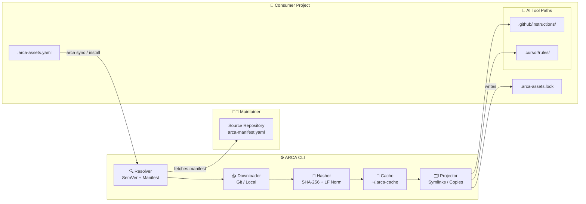

# 🤖 ARCA: Asset Resolution for AI Assistants

ARCA is a decentralized standard for distributing, versioning, and consuming agentic assets (rules, skills, instructions).

## 🧩 What is ARCA?

ARCA provides a unified way for AI assistants—including coding agents (Copilot, Cursor), web agents (Manus), and general LLMs (ChatGPT, Gemini)—to discover and integrate specialized assets. By using Git-based manifests and deterministic locking, ARCA ensures that your agents always have the right version of the instructions they need.

## ✨ Core Features

- 🌐 **Decentralized Registry**: Host your assets in any Git repository or local folder.
- 🔒 **Deterministic Locking**: Reproducible environments with `.arca-assets.lock`.
- ⚡ **High Performance**: Zero-dependency Go CLI for fast resolution and syncing.
- 🔀 **Multi-Assistant Projections**: Sync one asset to multiple locations (e.g., `.cursor/rules` and `.github/instructions`).
- 🛡️ **Strict Integrity**: SHA-256 verification with mandatory LF-normalization for cross-platform consistency.
- 📱 **Mobile Friendly**: Built to run on Windows, macOS, Linux, Android, and iOS.

## 🏗️ Architecture



## 🚀 Quick Start

1. ⬇️ **Install ARCA**:
   - See [Getting Started](./getting-started.md) for details.
   - Or use [arca-vscode](https://github.com/adryledo/arca-vscode) VS Code extension for interactive asset selection.
2. 📦 **Add an Asset**:
    ```bash
    arca install https://github.com/org/assets my-asset --target .github/instructions/my-asset.md
    ```
3. 🔄 **Sync**:
    ```bash
    arca sync
    ```

## 📚 Documentation Index

- [🎯 Purpose & Benefits](./purpose.md) - Why we built ARCA.
- [🚀 Getting Started](./getting-started.md) - How to install and use the CLI.
- [🔬 Protocol Deep-Dive](./protocol.md) - How the manifests and resolution flows work.
- [🤝 Contribution Guide](./CONTRIBUTING.md) - How to improve ARCA.
- [🗺️ Roadmap](./ROADMAP.md) - Future plans for ARCA.
- [📜 Code of Conduct](./CODE_OF_CONDUCT.md) - Community standards.

## ⚖️ License

ARCA is released under the [MIT License](../LICENSE).
